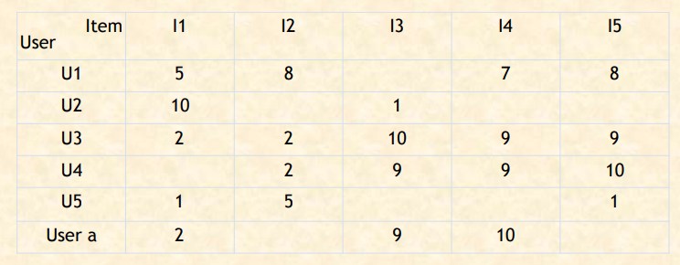
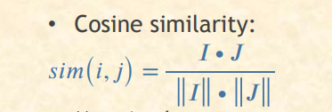
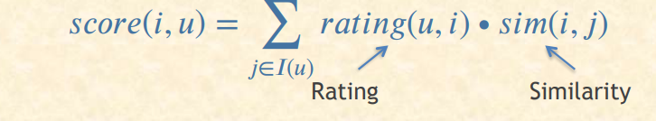

# Section 7
### Recommender Systems

The objective of a RecSys is to recommend relevant items for users, based on their preference.
We will take in this section about the concept of collaborative filtering:
#### Collaborative based filtering:
Collaborative Filtering: This method makes automatic predictions (filtering) about the interests of a user by collecting preferences or taste information from many users (collaborating). The underlying assumption of the collaborative filtering approach is that if a person A has the same opinion as a person B on a set of items, A is more likely to have B's opinion for a given item than that of a randomly chosen person.

 


    

Forms or classes of CF:
* User-based, which measures the similarity between target users and other users.
* Item-based, which measures the similarity between the items that target users rate or interact with and other items.






#### The Score function for Item based CF


Let's see CF on practice:


```python
# import pandas library 
import pandas as pd 
  
# Get the data 
column_names = ['user_id', 'item_id', 'rating', 'timestamp'] 
  
path = 'file.tsv'
  
df = pd.read_csv(path, sep='\t', names=column_names) 
  
# Check the head of the data 
df.head() 
```


<div>
<style scoped>
    .dataframe tbody tr th:only-of-type {
        vertical-align: middle;
    }

    .dataframe tbody tr th {
        vertical-align: top;
    }

    .dataframe thead th {
        text-align: right;
    }
</style>
<table border="1" class="dataframe">
  <thead>
    <tr style="text-align: right;">
      <th></th>
      <th>user_id</th>
      <th>item_id</th>
      <th>rating</th>
      <th>timestamp</th>
    </tr>
  </thead>
  <tbody>
    <tr>
      <th>0</th>
      <td>0</td>
      <td>50</td>
      <td>5</td>
      <td>881250949</td>
    </tr>
    <tr>
      <th>1</th>
      <td>0</td>
      <td>172</td>
      <td>5</td>
      <td>881250949</td>
    </tr>
    <tr>
      <th>2</th>
      <td>0</td>
      <td>133</td>
      <td>1</td>
      <td>881250949</td>
    </tr>
    <tr>
      <th>3</th>
      <td>196</td>
      <td>242</td>
      <td>3</td>
      <td>881250949</td>
    </tr>
    <tr>
      <th>4</th>
      <td>186</td>
      <td>302</td>
      <td>3</td>
      <td>891717742</td>
    </tr>
  </tbody>
</table>
</div>


```python
# Check out all the movies and their respective IDs 
movie_titles = pd.read_csv('Movie_Id_Titles.csv') 
movie_titles.head() 

```


<div>
<style scoped>
    .dataframe tbody tr th:only-of-type {
        vertical-align: middle;
    }

    .dataframe tbody tr th {
        vertical-align: top;
    }

    .dataframe thead th {
        text-align: right;
    }
</style>
<table border="1" class="dataframe">
  <thead>
    <tr style="text-align: right;">
      <th></th>
      <th>item_id</th>
      <th>title</th>
    </tr>
  </thead>
  <tbody>
    <tr>
      <th>0</th>
      <td>1</td>
      <td>Toy Story (1995)</td>
    </tr>
    <tr>
      <th>1</th>
      <td>2</td>
      <td>GoldenEye (1995)</td>
    </tr>
    <tr>
      <th>2</th>
      <td>3</td>
      <td>Four Rooms (1995)</td>
    </tr>
    <tr>
      <th>3</th>
      <td>4</td>
      <td>Get Shorty (1995)</td>
    </tr>
    <tr>
      <th>4</th>
      <td>5</td>
      <td>Copycat (1995)</td>
    </tr>
  </tbody>
</table>
</div>


```python
data = pd.merge(df, movie_titles, on='item_id') 
data.head()
```


<div>
<style scoped>
    .dataframe tbody tr th:only-of-type {
        vertical-align: middle;
    }

    .dataframe tbody tr th {
        vertical-align: top;
    }

    .dataframe thead th {
        text-align: right;
    }
</style>
<table border="1" class="dataframe">
  <thead>
    <tr style="text-align: right;">
      <th></th>
      <th>user_id</th>
      <th>item_id</th>
      <th>rating</th>
      <th>timestamp</th>
      <th>title</th>
    </tr>
  </thead>
  <tbody>
    <tr>
      <th>0</th>
      <td>0</td>
      <td>50</td>
      <td>5</td>
      <td>881250949</td>
      <td>Star Wars (1977)</td>
    </tr>
    <tr>
      <th>1</th>
      <td>290</td>
      <td>50</td>
      <td>5</td>
      <td>880473582</td>
      <td>Star Wars (1977)</td>
    </tr>
    <tr>
      <th>2</th>
      <td>79</td>
      <td>50</td>
      <td>4</td>
      <td>891271545</td>
      <td>Star Wars (1977)</td>
    </tr>
    <tr>
      <th>3</th>
      <td>2</td>
      <td>50</td>
      <td>5</td>
      <td>888552084</td>
      <td>Star Wars (1977)</td>
    </tr>
    <tr>
      <th>4</th>
      <td>8</td>
      <td>50</td>
      <td>5</td>
      <td>879362124</td>
      <td>Star Wars (1977)</td>
    </tr>
  </tbody>
</table>
</div>


```python
# Calculate mean rating of all movies 
data.groupby('title')['rating'].mean().sort_values(ascending=False).head() 

```


    title
    Marlene Dietrich: Shadow and Light (1996)     5.0
    Prefontaine (1997)                            5.0
    Santa with Muscles (1996)                     5.0
    Star Kid (1997)                               5.0
    Someone Else's America (1995)                 5.0
    Name: rating, dtype: float64


```python
# Calculate mean rating of all movies 
data.groupby('title')['rating'].count().sort_values(ascending=False).head() 

```


    title
    Star Wars (1977)             584
    Contact (1997)               509
    Fargo (1996)                 508
    Return of the Jedi (1983)    507
    Liar Liar (1997)             485
    Name: rating, dtype: int64


```python
# creating dataframe with 'rating' count values 
ratings = pd.DataFrame(data.groupby('title')['rating'].mean()) 

ratings['num of ratings'] = pd.DataFrame(data.groupby('title')['rating'].count()) 

ratings.head()

```


<div>
<style scoped>
    .dataframe tbody tr th:only-of-type {
        vertical-align: middle;
    }

    .dataframe tbody tr th {
        vertical-align: top;
    }

    .dataframe thead th {
        text-align: right;
    }
</style>
<table border="1" class="dataframe">
  <thead>
    <tr style="text-align: right;">
      <th></th>
      <th>rating</th>
      <th>num of ratings</th>
    </tr>
    <tr>
      <th>title</th>
      <th></th>
      <th></th>
    </tr>
  </thead>
  <tbody>
    <tr>
      <th>'Til There Was You (1997)</th>
      <td>2.333333</td>
      <td>9</td>
    </tr>
    <tr>
      <th>1-900 (1994)</th>
      <td>2.600000</td>
      <td>5</td>
    </tr>
    <tr>
      <th>101 Dalmatians (1996)</th>
      <td>2.908257</td>
      <td>109</td>
    </tr>
    <tr>
      <th>12 Angry Men (1957)</th>
      <td>4.344000</td>
      <td>125</td>
    </tr>
    <tr>
      <th>187 (1997)</th>
      <td>3.024390</td>
      <td>41</td>
    </tr>
  </tbody>
</table>
</div>


```python
moviemat = data.pivot_table(index ='user_id', 
              columns ='title', values ='rating') 
  
moviemat.head() 
  
#ratings.sort_values('num of ratings', ascending = False).head(10) 
```


<div>
<style scoped>
    .dataframe tbody tr th:only-of-type {
        vertical-align: middle;
    }

    .dataframe tbody tr th {
        vertical-align: top;
    }

    .dataframe thead th {
        text-align: right;
    }
</style>
<table border="1" class="dataframe">
  <thead>
    <tr style="text-align: right;">
      <th>title</th>
      <th>'Til There Was You (1997)</th>
      <th>1-900 (1994)</th>
      <th>101 Dalmatians (1996)</th>
      <th>12 Angry Men (1957)</th>
      <th>187 (1997)</th>
      <th>2 Days in the Valley (1996)</th>
      <th>20,000 Leagues Under the Sea (1954)</th>
      <th>2001: A Space Odyssey (1968)</th>
      <th>3 Ninjas: High Noon At Mega Mountain (1998)</th>
      <th>39 Steps, The (1935)</th>
      <th>...</th>
      <th>Yankee Zulu (1994)</th>
      <th>Year of the Horse (1997)</th>
      <th>You So Crazy (1994)</th>
      <th>Young Frankenstein (1974)</th>
      <th>Young Guns (1988)</th>
      <th>Young Guns II (1990)</th>
      <th>Young Poisoner's Handbook, The (1995)</th>
      <th>Zeus and Roxanne (1997)</th>
      <th>unknown</th>
      <th>Á köldum klaka (Cold Fever) (1994)</th>
    </tr>
    <tr>
      <th>user_id</th>
      <th></th>
      <th></th>
      <th></th>
      <th></th>
      <th></th>
      <th></th>
      <th></th>
      <th></th>
      <th></th>
      <th></th>
      <th></th>
      <th></th>
      <th></th>
      <th></th>
      <th></th>
      <th></th>
      <th></th>
      <th></th>
      <th></th>
      <th></th>
      <th></th>
    </tr>
  </thead>
  <tbody>
    <tr>
      <th>0</th>
      <td>NaN</td>
      <td>NaN</td>
      <td>NaN</td>
      <td>NaN</td>
      <td>NaN</td>
      <td>NaN</td>
      <td>NaN</td>
      <td>NaN</td>
      <td>NaN</td>
      <td>NaN</td>
      <td>...</td>
      <td>NaN</td>
      <td>NaN</td>
      <td>NaN</td>
      <td>NaN</td>
      <td>NaN</td>
      <td>NaN</td>
      <td>NaN</td>
      <td>NaN</td>
      <td>NaN</td>
      <td>NaN</td>
    </tr>
    <tr>
      <th>1</th>
      <td>NaN</td>
      <td>NaN</td>
      <td>2.0</td>
      <td>5.0</td>
      <td>NaN</td>
      <td>NaN</td>
      <td>3.0</td>
      <td>4.0</td>
      <td>NaN</td>
      <td>NaN</td>
      <td>...</td>
      <td>NaN</td>
      <td>NaN</td>
      <td>NaN</td>
      <td>5.0</td>
      <td>3.0</td>
      <td>NaN</td>
      <td>NaN</td>
      <td>NaN</td>
      <td>4.0</td>
      <td>NaN</td>
    </tr>
    <tr>
      <th>2</th>
      <td>NaN</td>
      <td>NaN</td>
      <td>NaN</td>
      <td>NaN</td>
      <td>NaN</td>
      <td>NaN</td>
      <td>NaN</td>
      <td>NaN</td>
      <td>1.0</td>
      <td>NaN</td>
      <td>...</td>
      <td>NaN</td>
      <td>NaN</td>
      <td>NaN</td>
      <td>NaN</td>
      <td>NaN</td>
      <td>NaN</td>
      <td>NaN</td>
      <td>NaN</td>
      <td>NaN</td>
      <td>NaN</td>
    </tr>
    <tr>
      <th>3</th>
      <td>NaN</td>
      <td>NaN</td>
      <td>NaN</td>
      <td>NaN</td>
      <td>2.0</td>
      <td>NaN</td>
      <td>NaN</td>
      <td>NaN</td>
      <td>NaN</td>
      <td>NaN</td>
      <td>...</td>
      <td>NaN</td>
      <td>NaN</td>
      <td>NaN</td>
      <td>NaN</td>
      <td>NaN</td>
      <td>NaN</td>
      <td>NaN</td>
      <td>NaN</td>
      <td>NaN</td>
      <td>NaN</td>
    </tr>
    <tr>
      <th>4</th>
      <td>NaN</td>
      <td>NaN</td>
      <td>NaN</td>
      <td>NaN</td>
      <td>NaN</td>
      <td>NaN</td>
      <td>NaN</td>
      <td>NaN</td>
      <td>NaN</td>
      <td>NaN</td>
      <td>...</td>
      <td>NaN</td>
      <td>NaN</td>
      <td>NaN</td>
      <td>NaN</td>
      <td>NaN</td>
      <td>NaN</td>
      <td>NaN</td>
      <td>NaN</td>
      <td>NaN</td>
      <td>NaN</td>
    </tr>
  </tbody>
</table>
<p>5 rows × 1664 columns</p>
</div>


```python
ratings.sort_values('num of ratings', ascending = False).head(10) 
```


<div>
<style scoped>
    .dataframe tbody tr th:only-of-type {
        vertical-align: middle;
    }

    .dataframe tbody tr th {
        vertical-align: top;
    }

    .dataframe thead th {
        text-align: right;
    }
</style>
<table border="1" class="dataframe">
  <thead>
    <tr style="text-align: right;">
      <th></th>
      <th>rating</th>
      <th>num of ratings</th>
    </tr>
    <tr>
      <th>title</th>
      <th></th>
      <th></th>
    </tr>
  </thead>
  <tbody>
    <tr>
      <th>Star Wars (1977)</th>
      <td>4.359589</td>
      <td>584</td>
    </tr>
    <tr>
      <th>Contact (1997)</th>
      <td>3.803536</td>
      <td>509</td>
    </tr>
    <tr>
      <th>Fargo (1996)</th>
      <td>4.155512</td>
      <td>508</td>
    </tr>
    <tr>
      <th>Return of the Jedi (1983)</th>
      <td>4.007890</td>
      <td>507</td>
    </tr>
    <tr>
      <th>Liar Liar (1997)</th>
      <td>3.156701</td>
      <td>485</td>
    </tr>
    <tr>
      <th>English Patient, The (1996)</th>
      <td>3.656965</td>
      <td>481</td>
    </tr>
    <tr>
      <th>Scream (1996)</th>
      <td>3.441423</td>
      <td>478</td>
    </tr>
    <tr>
      <th>Toy Story (1995)</th>
      <td>3.878319</td>
      <td>452</td>
    </tr>
    <tr>
      <th>Air Force One (1997)</th>
      <td>3.631090</td>
      <td>431</td>
    </tr>
    <tr>
      <th>Independence Day (ID4) (1996)</th>
      <td>3.438228</td>
      <td>429</td>
    </tr>
  </tbody>
</table>
</div>


```python
# analysing correlation with similar movies 
starwars_user_ratings = moviemat['Star Wars (1977)'] 
liarliar_user_ratings = moviemat['Liar Liar (1997)'] 
  
starwars_user_ratings.head() 
```


    user_id
    0    5.0
    1    5.0
    2    5.0
    3    NaN
    4    5.0
    Name: Star Wars (1977), dtype: float64


```python
# analysing correlation with similar movies 
similar_to_starwars = moviemat.corrwith(starwars_user_ratings) 
similar_to_liarliar = moviemat.corrwith(liarliar_user_ratings) 

corr_starwars = pd.DataFrame(similar_to_starwars, columns =['Correlation']) 
corr_starwars.dropna(inplace = True) 

corr_starwars.head() 

```

    C:\Users\Dell\anaconda3\lib\site-packages\numpy\lib\function_base.py:2526: RuntimeWarning: Degrees of freedom <= 0 for slice
      c = cov(x, y, rowvar)
    C:\Users\Dell\anaconda3\lib\site-packages\numpy\lib\function_base.py:2455: RuntimeWarning: divide by zero encountered in true_divide
      c *= np.true_divide(1, fact)
    


<div>
<style scoped>
    .dataframe tbody tr th:only-of-type {
        vertical-align: middle;
    }

    .dataframe tbody tr th {
        vertical-align: top;
    }

    .dataframe thead th {
        text-align: right;
    }
</style>
<table border="1" class="dataframe">
  <thead>
    <tr style="text-align: right;">
      <th></th>
      <th>Correlation</th>
    </tr>
    <tr>
      <th>title</th>
      <th></th>
    </tr>
  </thead>
  <tbody>
    <tr>
      <th>'Til There Was You (1997)</th>
      <td>0.872872</td>
    </tr>
    <tr>
      <th>1-900 (1994)</th>
      <td>-0.645497</td>
    </tr>
    <tr>
      <th>101 Dalmatians (1996)</th>
      <td>0.211132</td>
    </tr>
    <tr>
      <th>12 Angry Men (1957)</th>
      <td>0.184289</td>
    </tr>
    <tr>
      <th>187 (1997)</th>
      <td>0.027398</td>
    </tr>
  </tbody>
</table>
</div>


```python
# Similar movies like starwars 
corr_starwars.sort_values('Correlation', ascending = False).head(10) 
corr_starwars = corr_starwars.join(ratings['num of ratings']) 

corr_starwars.head() 

corr_starwars[corr_starwars['num of ratings']>100].sort_values('Correlation', ascending = False).head() 

```


<div>
<style scoped>
    .dataframe tbody tr th:only-of-type {
        vertical-align: middle;
    }

    .dataframe tbody tr th {
        vertical-align: top;
    }

    .dataframe thead th {
        text-align: right;
    }
</style>
<table border="1" class="dataframe">
  <thead>
    <tr style="text-align: right;">
      <th></th>
      <th>Correlation</th>
      <th>num of ratings</th>
    </tr>
    <tr>
      <th>title</th>
      <th></th>
      <th></th>
    </tr>
  </thead>
  <tbody>
    <tr>
      <th>Star Wars (1977)</th>
      <td>1.000000</td>
      <td>584</td>
    </tr>
    <tr>
      <th>Empire Strikes Back, The (1980)</th>
      <td>0.748353</td>
      <td>368</td>
    </tr>
    <tr>
      <th>Return of the Jedi (1983)</th>
      <td>0.672556</td>
      <td>507</td>
    </tr>
    <tr>
      <th>Raiders of the Lost Ark (1981)</th>
      <td>0.536117</td>
      <td>420</td>
    </tr>
    <tr>
      <th>Austin Powers: International Man of Mystery (1997)</th>
      <td>0.377433</td>
      <td>130</td>
    </tr>
  </tbody>
</table>
</div>


```python
# Similar movies as of liarliar 
corr_liarliar = pd.DataFrame(similar_to_liarliar, columns =['Correlation']) 
corr_liarliar.dropna(inplace = True) 

corr_liarliar = corr_liarliar.join(ratings['num of ratings']) 
corr_liarliar[corr_liarliar['num of ratings']>150].sort_values('Correlation', ascending = False).head() 

```


<div>
<style scoped>
    .dataframe tbody tr th:only-of-type {
        vertical-align: middle;
    }

    .dataframe tbody tr th {
        vertical-align: top;
    }

    .dataframe thead th {
        text-align: right;
    }
</style>
<table border="1" class="dataframe">
  <thead>
    <tr style="text-align: right;">
      <th></th>
      <th>Correlation</th>
      <th>num of ratings</th>
    </tr>
    <tr>
      <th>title</th>
      <th></th>
      <th></th>
    </tr>
  </thead>
  <tbody>
    <tr>
      <th>Liar Liar (1997)</th>
      <td>1.000000</td>
      <td>485</td>
    </tr>
    <tr>
      <th>Pretty Woman (1990)</th>
      <td>0.469790</td>
      <td>164</td>
    </tr>
    <tr>
      <th>Indiana Jones and the Last Crusade (1989)</th>
      <td>0.414427</td>
      <td>331</td>
    </tr>
    <tr>
      <th>Top Gun (1986)</th>
      <td>0.405720</td>
      <td>220</td>
    </tr>
    <tr>
      <th>G.I. Jane (1997)</th>
      <td>0.397931</td>
      <td>175</td>
    </tr>
  </tbody>
</table>
</div>


```python

```
